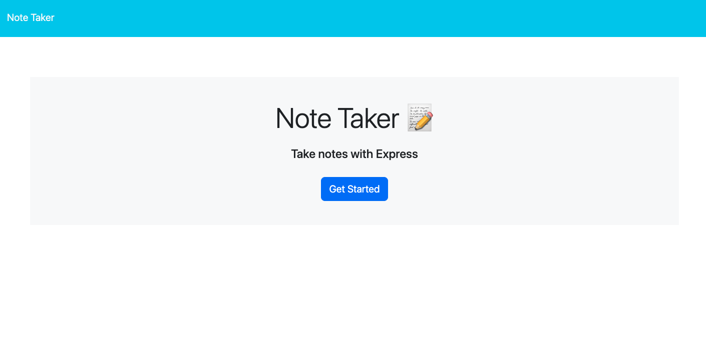
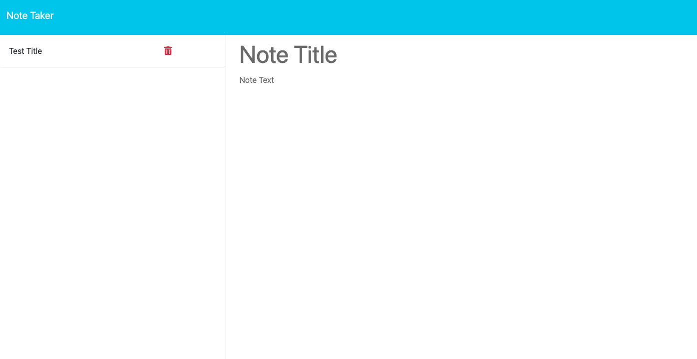

# expressjs-note-taker

## Table of Contents

[Description](#description)
 
[Technologies Used](#technologies-used)
 
[Usage](#usage)
 
[Credits](#credits)

## Description

The purpose of the application is to write and save notes. It uses an Express.js back end to save and retrieve note data from a JSON file. It is deployed on Heroku.

You can find the deployed application [here](https://safe-bastion-51547-4080b50e9189.herokuapp.com/)

The following screenshots demonstrates the applications functionality: 
Homepage:
 

 
Note page:
 

## Technologies Used

* HTML
* CSS
* JavaScript
* Node.js
* Express.js
* File System Module
* Heroku

## Usage

* To use this application, type in a title and note description; then press Save Note button.

* To delete a note, press the trashcan icon next to the note you would like to delete.

## Credits

* Starter code provided by edX Boot Camps LLC.
* All updates made by Conner Martin aka Conartisttt